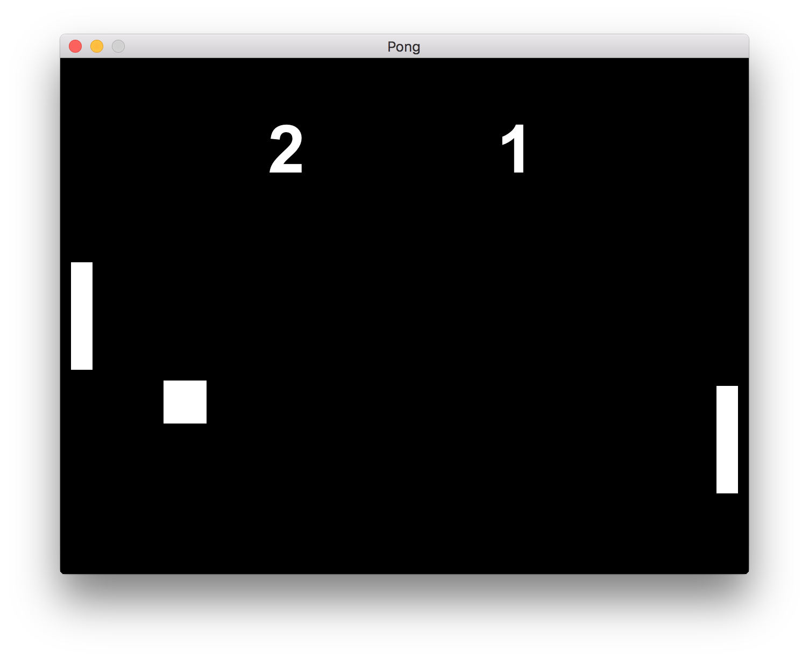

# Pong



## Installation

You need [Homebrew](https://brew.sh/) installed.

```
# If you don't already have Ruby and Bundler, run this first:
brew install ruby
gem install bundler

# To install the dependencies of this game, run this:
brew install sdl2 # I used sdl2-2.0.5
bundle
```

https://github.com/gosu/gosu/wiki/Getting-Started-on-OS-X

## Play the game

Start the game with `bundle exec ruby pong.rb`, or run the `Pong.app` executable.

- <kbd>↑</kbd> and <kbd>↓</kbd> control the left paddle
- <kbd>R</kbd> restarts the game
- <kbd>Q</kbd> quits

## Releasing

A macOS distributable is available in the `pkg/` folder, and can be updated with changes to the code like this:

```
bundle exec rake release
```
